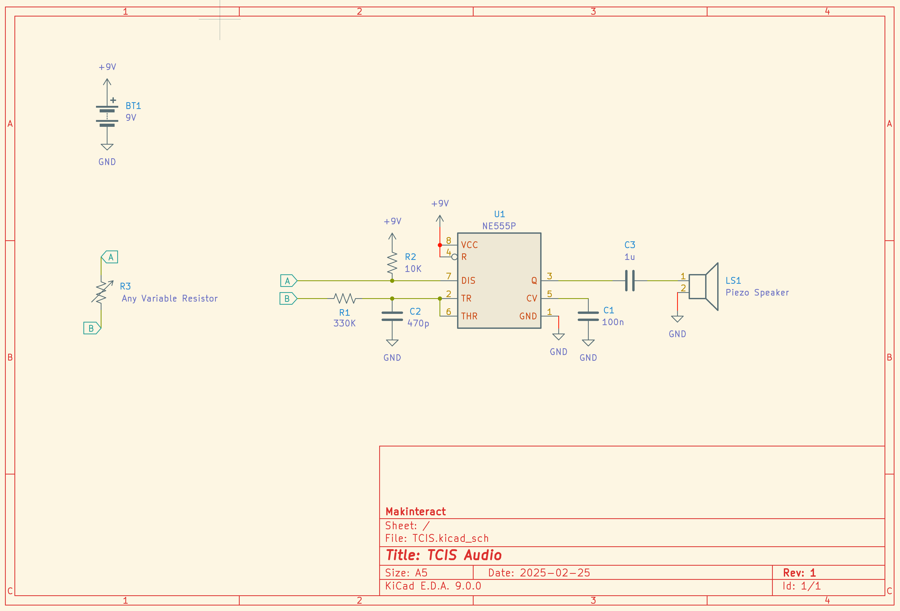

# TCIS-music-board

A simple board to make music with a 555 timer. Designed with [KiCad](https://kicad.org/).

## Schematic diagram

Here the full schematics: [schematics and board](./schematics_board.pdf)
